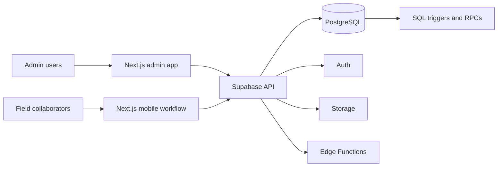
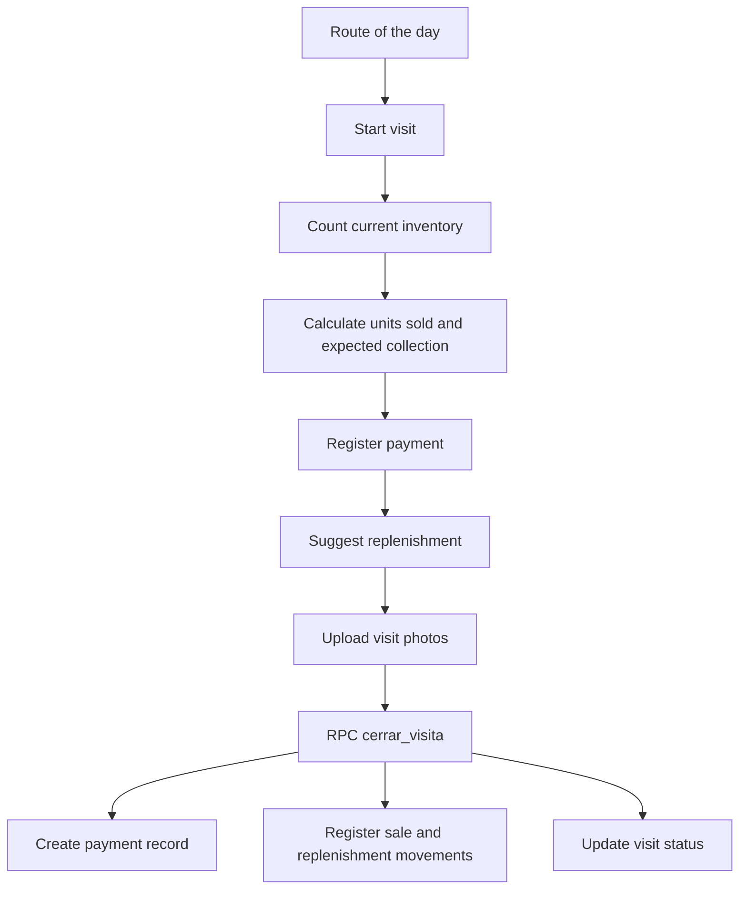
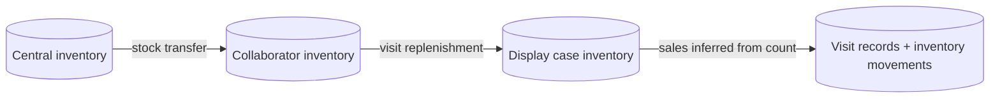

<div align="center">

# powERP

**ERP / CRM / field operations platform for consignment-based retail networks**

Digitalizing the full in-store visit workflow for an accessories business operating across **200+ retail locations**: route planning, visit execution, inventory counting, cash collection, replenishment, and admin visibility.

[](https://nextjs.org/)
[](https://react.dev/)
[](https://www.typescriptlang.org/)
[](https://supabase.com/)
[](https://playwright.dev/)
[](https://vitest.dev/)

</div>

## Overview

`powERP` is a production-oriented operations platform built for a business model where products are placed in third-party retail stores on consignment.  
Instead of relying on spreadsheets, WhatsApp coordination, and manual reconciliation, the system centralizes:

- field routes and daily visit execution
- display-case inventory control
- sales calculation from physical counts
- collection tracking and payment method registration
- replenishment flows from central stock to field staff to display cases
- admin visibility into visit status, discrepancies, and stock movement

The project is structured as a real business system, not just a CRUD demo. It includes transactional inventory logic, role-based access, SQL triggers, and end-to-end coverage for critical workflows.

## What Makes This Project Strong

- **Operationally grounded**: modeled around real field visits, real stock movement, and real reconciliation problems.
- **Mobile-first field workflow**: collaborators can execute store visits from the field with a structured, staged flow.
- **Data integrity first**: stock is maintained through immutable inventory movements plus SQL triggers and RPCs.
- **Role-aware access model**: admin and field experiences are separated at both UI and database policy levels.
- **Tested critical paths**: authentication, admin modules, route execution, visit counting, and visit closing flows are covered by automated tests.

## Core Workflows

### Admin

- manage users, products, categories, routes, display cases, and points of sale
- track planned vs completed visits
- manage payment methods
- assign central inventory to field collaborators
- review discrepancies and visit outcomes

### Field Operations

- view the route of the day
- start a visit at a specific point of sale
- count current inventory in the display case
- calculate units sold and amount to collect
- register payment and discrepancy notes when needed
- replenish products from collaborator inventory
- upload visit photos and close the visit transactionally

## Architecture

### Frontend

- Next.js 16 App Router
- React 19
- Tailwind CSS v4
- shadcn/ui
- TanStack React Query v5

### Backend

- Supabase PostgreSQL
- Supabase Auth
- Supabase Storage
- Supabase Edge Functions
- Row Level Security policies

### Domain Model Highlights

- `movimientos_inventario` is the immutable source of truth for stock changes
- denormalized stock tables are maintained through SQL triggers
- visit closing is handled atomically through PostgreSQL RPC
- field inventory follows the model:

```text
central stock -> collaborator inventory -> display case inventory
```

## Architecture Diagrams

### Application Landscape



### Visit Closing Flow



### Inventory Ownership Model



## Current Product Scope

Implemented and validated so far:

- authentication and role-based routing
- products, categories, users, and points of sale
- display cases, central inventory, and routes
- route-of-the-day experience for field collaborators
- visit start and inventory counting
- payment capture, replenishment, visit photos, and transactional visit closing

Next major milestone:

- advanced incident handling, inventory loss flows, reporting, analytics, and deeper operational scale

## Tech Stack

| Layer | Tools |
| --- | --- |
| Frontend | Next.js 16, React 19, Tailwind CSS v4, shadcn/ui |
| State & data | TanStack React Query v5, Zustand |
| Backend | Supabase, PostgreSQL, PostgREST, Edge Functions |
| Validation | Zod, React Hook Form |
| Auth & security | Supabase Auth, JWT, Row Level Security |
| Testing | Playwright, Vitest |
| Deployment target | Vercel + Supabase Cloud |

## Repository Structure

```text
powERP/
├── erp-vitrinas/                 # Main application
│   ├── app/                      # Next.js App Router pages
│   ├── components/               # Admin, field, and UI components
│   ├── lib/                      # Hooks, validations, helpers, Supabase clients
│   ├── supabase/
│   │   ├── migrations/           # SQL schema and business-logic migrations
│   │   └── functions/            # Edge Functions
│   └── tests/                    # Playwright end-to-end tests
├── docs/                         # Sprint plans and technical documentation
├── CLAUDE.md                     # Working conventions and project rules
├── CODEX_CONTEXT.md              # Project operating context
└── SPRINTS.md                    # Delivery tracking by sprint
```

## Local Setup

### Prerequisites

- Node.js 20+
- Docker
- Supabase CLI

### Run Locally

```bash
git clone https://github.com/scldrn/powERP.git
cd powERP/erp-vitrinas

npm install
cp .env.example .env.local

supabase start
supabase db reset
npm run seed:auth

npm run dev
```

App URL: `http://localhost:3000`

### Environment Variables

```env
NEXT_PUBLIC_SUPABASE_URL=http://127.0.0.1:54321
NEXT_PUBLIC_SUPABASE_ANON_KEY=your-anon-key
SUPABASE_SERVICE_ROLE_KEY=your-service-role-key
NEXT_PUBLIC_APP_URL=http://localhost:3000
STORAGE_BUCKET_FOTOS=fotos-visita
```

## Quality Checks

Run the main verification commands from `erp-vitrinas/`:

```bash
npm run type-check
npm run lint
npm test
npm run build
npm run test:e2e
```

## Why This Repo Matters

This is one of the strongest projects in my portfolio because it combines:

- real operational domain modeling
- product thinking for both admin and field users
- backend rigor through SQL business rules
- end-to-end ownership from schema design to UX and testing

It is the kind of system that sits between internal tooling and a specialized SaaS product: highly practical, process-driven, and shaped by real-world constraints.

## Roadmap

- incident and loss workflows
- inventory history and valuation reports
- analytics dashboards
- exportable operational reports
- offline-first improvements for field execution

## License

MIT
